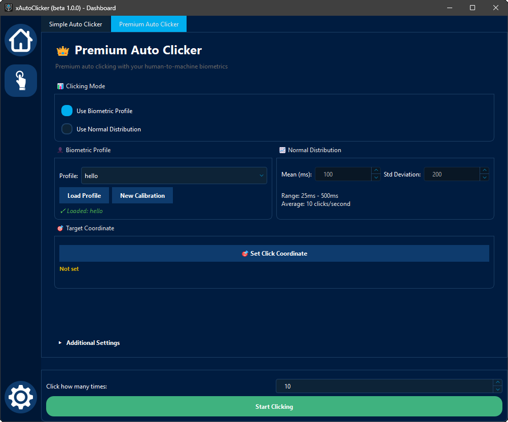

# ⚔️ xAutoClicker AI — PvP Edition

### Best Minecraft PVP Autoclicker - Clicking Intelligence for Minecraft PvP

**[⬇ Download](https://xautoclicker.com/download) • [🛡 Safety](#-pvp-safety--legitimacy) • [📊 Editions](#-editions--pricing)**

*Designed for competitive Minecraft PvP — not generic automation.*

---

## 🎮 Built for Minecraft Combat

**xAutoClicker AI – PvP Edition** is engineered specifically for Minecraft combat mechanics, from **1.8 CPS-based PvP** to **modern cooldown-aware versions**.

Instead of artificial clicking, it reproduces **real player behavior**:
- Variable CPS under pressure
- Natural block-hit timing
- Missed clicks and recovery delays
- Cursor micro-movements during strafes

This results in **legitimate-looking PvP performance**, not robotic spam.

---

### 🧬 Biometric PvP Profiles
- Learns *your* clicking rhythm
- Adjusts CPS during long fights
- Reacts to mouse movement speed
- Builds unique per-user entropy

Each profile is:
- Stored locally
- Encrypted
- Resettable anytime

---

## 🛡 PvP Safety & Legitimacy

### Designed to Look Real — Not Perfect
- Human error injection  
- Micro cursor shake during clicks  
- CPS fatigue simulation  
- Randomized release timing  

### Client & Server Friendly
- Works with:
  - Lunar Client  
  - Badlion Client  
  - Forge / Fabric  
  - Vanilla Minecraft  

> ⚠️ Hypixel & similar servers require conservative settings.

---

## ⌨️ PvP Hotkey System

- Toggle / Hold modes  
- Mouse4 / Mouse5 support  
- Per-feature keybinds  
- Instant emergency disable  

---

## 🔒 Privacy & Security

- 100% local execution  
- No keystroke logging  
- No account access  
- No network dependency for PvP features  
- No hidden drivers or injections  

Your Minecraft account stays **untouched**.

---

## 📦 Editions & Pricing

| Edition | PvP Features |
|------|-------------|
| **Free** | Manual CPS, basic clicking |
| **Pro Trial (7 Days)** | Full PvP AI engine |
| **Pro Monthly** | $22/month |
| **Lifetime PvP License** | $247 |

Includes:
- All future PvP AI updates
- New combat logic improvements
- Version-specific tuning

---

## 💻 System Requirements

| Component | Minimum | Recommended |
|---------|--------|-------------|
| OS | Windows 10 | Windows 11 |
| CPU | Single-Core | Dual-Core+ |
| RAM | 512 Mb | 2 GB+ |
| GPU | Not required | Not required |

---

## 🌟 Why PvP Players Choose xAutoClicker AI

✔ Built exclusively for Minecraft PvP  
✔ No static CPS or robotic loops  
✔ Version-aware combat logic  
✔ Legitimate-looking behavior  
✔ Privacy-first architecture  

**If it doesn’t feel human, it doesn’t ship.**

---

## 🔗 Community & Support

- Website: [xAutoClicker.com](https://xautoclicker.com)
- GitHub: [@xAutoClicker](https://github.com/xAutoClicker)
- Discord: [xAutoClicker.com/discord](https://xautoclicker.com/discord)

---

⚔️ **Fight smarter. Click human.**  
xAutoClicker AI — PvP Edition

